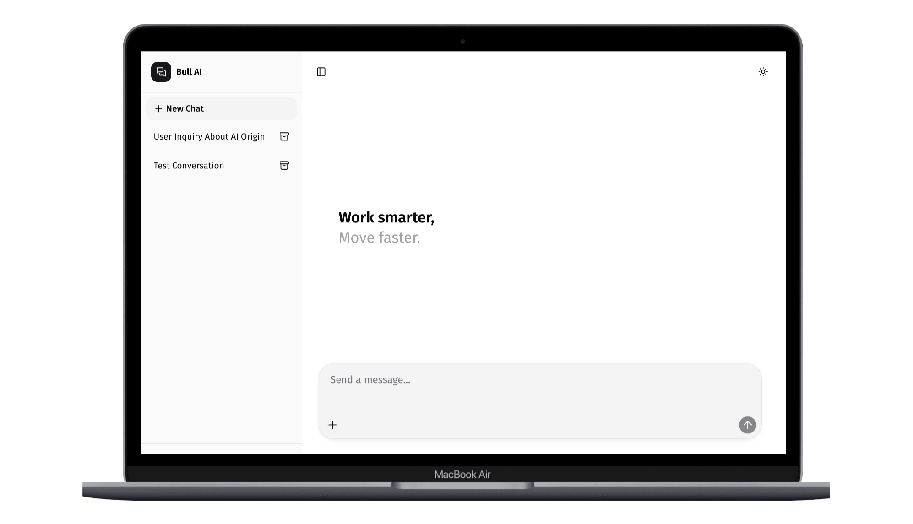
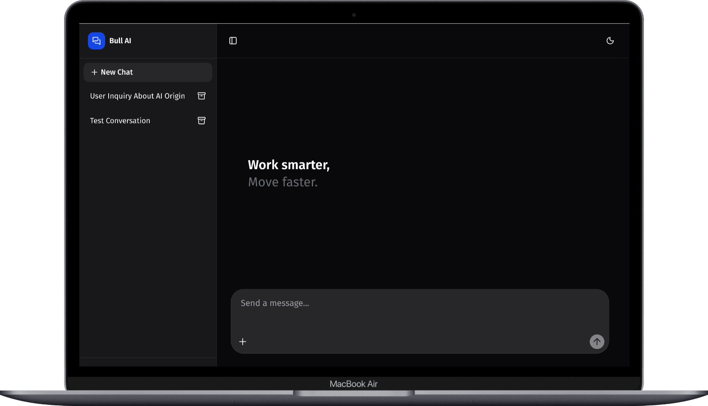

# Bull AI 🐂

> A *battery-packed* AI chatbot built with Next.js 15 and AI SDK 5. Easy deployment on Cloudflare Workers. Free, open-source, and designed for the AI revolution.

### Leave a star 🌟

---

## 📞 Contact

* **GitHub**: https://github.com/Pejern/Bull-AI
* **Portfolio**: https://skportfoliosite.pages.dev/

---

## 👨‍💻 About

**Shani Khandhar** — Full-stack developer passionate about AI, open-source software, and modern web technologies.

> "Technology becomes powerful when it helps people build, learn, and create without limits."

My journey in programming has been driven by curiosity, consistency, and the power of AI-assisted development. I believe AI should empower developers, creators, and businesses to innovate faster and build impactful solutions.

---

## 📚 Resources

1. [Assistant-UI Documentation](https://www.assistant-ui.com/docs/getting-started)
2. [Cloudflare Workers](https://www.cloudflare.com/)
3. [Portfolio Website](https://skportfoliosite.pages.dev/)
4. [GitHub Repository](https://github.com/Pejern/Bull-AI)

---

## ⭐ Why Star This Repo?

* 🚀 **Fast Deployment**: Launch instantly with Cloudflare Workers
* 🌍 **Global Reach**: 300+ Cloudflare edge locations
* 🤝 **Open Source**: Free to use and customize
* 🎯 **Developer Friendly**: Modern stack with Next.js 15 & AI SDK 5
* 📈 **AI Ready**: Multi-provider support and extensible architecture

**May the yield be with you!** 🌟

---

*Built with ❤️ for the open-source community. Clone, fork, contribute — let’s build the future together!*
